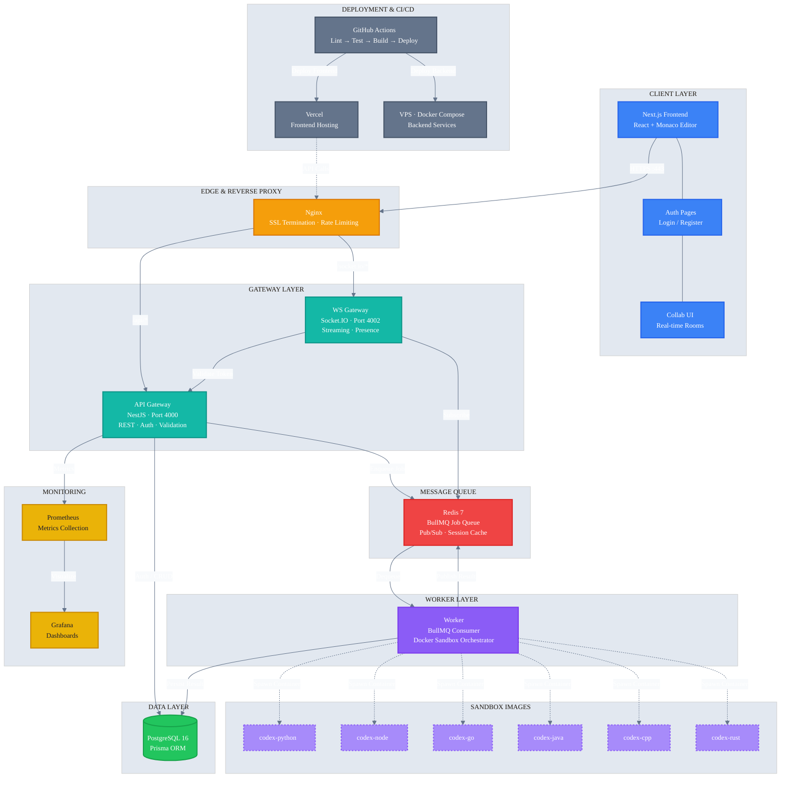
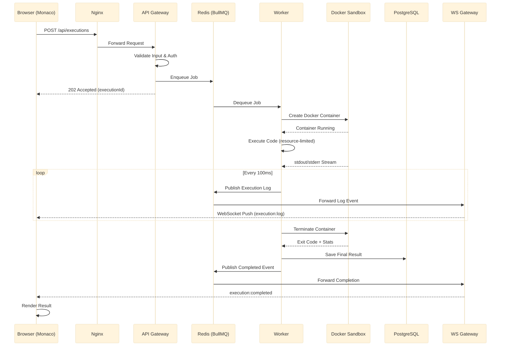

# Codex Platform — System Architecture

## System Design Diagram

## Execution Flow

## Diagrams (Editable)

| File | Description | Tool |
|------|-------------|------|
| `docs/architecture.svg` | Rendered SVG system diagram | View in any browser |
| `docs/architecture.drawio` | Editable diagram with shape library | Open at [app.diagrams.net](https://app.diagrams.net) |

## Key Design Decisions

| Decision | Rationale |
|----------|-----------|
| **API + WS split** | REST and WebSocket scale independently; WS connections are long-lived, REST is request/response |
| **BullMQ on Redis** | Redis already serves caching + Pub/Sub; BullMQ adds zero-infra job queue with retries, delays, DLQ |
| **Docker sandbox per execution** | Process-level isolation isn't sufficient for untrusted code; each execution gets a fresh container with `--network none`, read-only FS, no capabilities |
| **Nginx reverse proxy** | Single entry point with SSL termination, route-based splitting (`/api/*` → API, `/socket.io/*` → WS); backend services stay on internal network |
| **Prisma ORM** | Type-safe database client generated from schema; auto-migrations, joins, and nested queries reduce boilerplate |
| **Monorepo (Turbo)** | Shared types across frontend/backend; single `npm test` / `npm run lint` for all packages; coordinated versioning |
| **GHCR for images** | Build once in CI, push to registry; VPS pulls pre-built images instead of building on the server (faster deploys, no build deps on VPS) |
| **Vercel + VPS split** | Frontend on Vercel Edge network (fast global CDN, free tier); backend on VPS for Docker access (can't run Docker on Vercel) |

## Capacity Planning

| Service | CPU | Memory | Replicas | Storage |
|---------|-----|--------|----------|---------|
| Nginx | 0.1 | 128 MB | 1 | — |
| API Gateway | 0.5 | 512 MB | 1 | — |
| WS Gateway | 0.5 | 512 MB | 1 | — |
| Worker | 1.0 | 1 GB | 2 | — |
| PostgreSQL | 1.0 | 1 GB | 1 | 10 GB |
| Redis | 0.5 | 256 MB | 1 | — |
| Prometheus | 0.3 | 512 MB | 1 | 5 GB |
| Grafana | 0.2 | 256 MB | 1 | — |
| **Total** | **~4.1** | **~4.2 GB** | **9** | **15 GB** |
